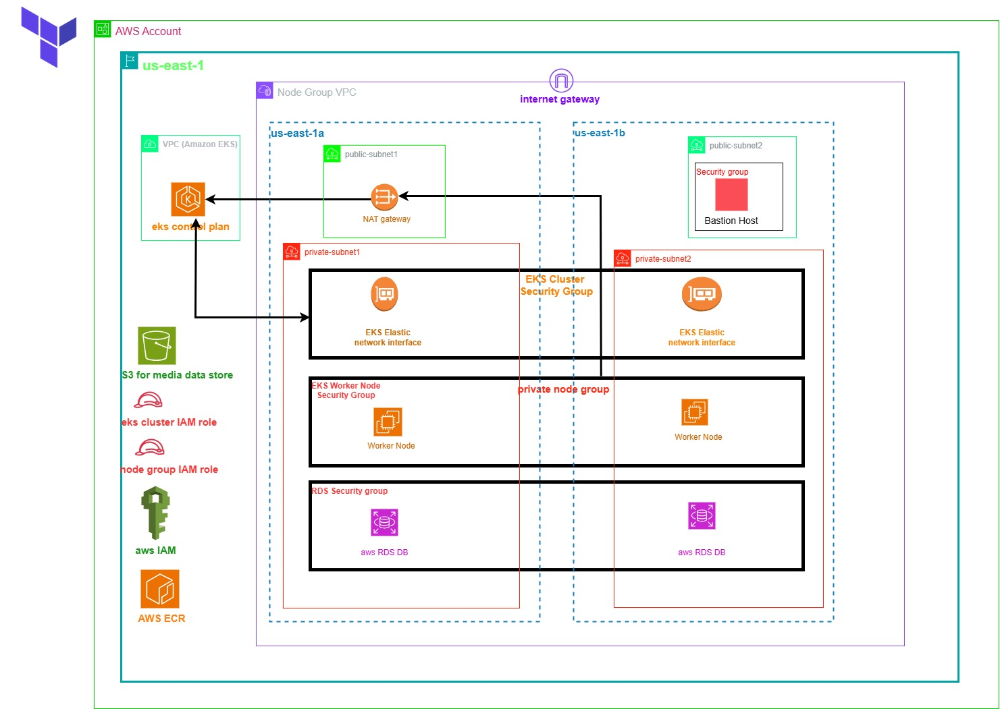

# AWS EKS Monitoring and Observability using OpenTelemetry, Grafana, Loki, Tempo, Prometheus, and AWS LoadBalancer Controller
# helm show values prometheus-community/kube-prometheus-stack > kube-prometheus-stack-values.yml 
->aws eks --region us-east-1 update-kubeconfig --name telemetry_cluster
->kubectl get secret --namespace monitoring loki-grafana -o jsonpath="{.data.admin-password}" |base64 --decode ; echo
sts.amazonaws.com
## encode:
--------
->echo -n mysql-clusterip-service | base64
->echo "SGVsbG8gd29ybGQh" | base64 --decode     #for decode

## installing cert manager:	
--------------------------
->helm install cert-manager cert-manager \
  --repo https://charts.jetstack.io \
  --namespace cert-manager \
  --create-namespace \
  --set crds.enabled=true

## installing EBS CSI driver using helm:
--------------------------------------
->helm repo add aws-ebs-csi-driver https://kubernetes-sigs.github.io/aws-ebs-csi-driver/
->helm repo update
->helm install aws-ebs-csi-driver aws-ebs-csi-driver/aws-ebs-csi-driver \
    --namespace kube-system \

## bucket policy:
---------------
''' json
{
    "Version": "2012-10-17",
    "Statement": [
        {
            "Sid": "PublicReadGetObject",
            "Effect": "Allow",
            "Principal": "*",
            "Action": "s3:GetObject",
            "Resource": "arn:aws:s3:::media-static-bucket-23edft67ujiosreeram/static/*"
        }
    ]
}
'''
{
    "Version": "2012-10-17",
    "Statement": [
        {
            "Sid": "PublicReadGetObject",
            "Effect": "Allow",
            "Principal": "*",
            "Action": "s3:GetObject",
            "Resource": "arn:aws:s3:::media-static-bucket-23edft67ujiosreeram/static/*"
        },
        {
            "Sid": "Statement1",
            "Effect": "Allow",
            "Principal": "*",
            "Action": "s3:GetObject",
            "Resource": "arn:aws:s3:::media-static-bucket-23edft67ujiosreeram/media/*"
        }
    ]
}
## Installing AWS loadbalancer controller:
------------------------------------------
->curl -o iam_policy_latest.json https://raw.githubusercontent.com/kubernetes-sigs/aws-load-balancer-controller/main/docs/install/iam_policy.json

->helm repo add eks https://aws.github.io/eks-charts
->helm repo update

**NOTE:
 If you're deploying to any Region other than us-west-2, then add the following flag to the command that you run, replacing account and region-code with the values for your region listed in Amazon EKS add-on container image addresses.
 ref: https://docs.aws.amazon.com/eks/latest/userguide/add-ons-images.html

->helm install aws-load-balancer-controller eks/aws-load-balancer-controller \
  -n kube-system \
  --set clusterName=<cluster-name> \
  --set serviceAccount.create=false \
  --set serviceAccount.name=aws-load-balancer-controller \
  --set region=<region-code> \
  --set vpcId=<vpc-xxxxxxxx> \
  --set image.repository=<account>.dkr.ecr.<region-code>.amazonaws.com/amazon/aws-load-balancer-controller

helm install aws-load-balancer-controller eks/aws-load-balancer-controller \
  -n kube-system \ 
  --set clusterName=telemetry_cluster \
  --set serviceAccount.create=false \
  --set serviceAccount.name=load-balancer-controller \
  --set region=us-east-1 \
  --set vpcId=vpc-0464aa4bf34edf853 \
  --set image.repository=602401143452.dkr.ecr.us-east-1.amazonaws.com/amazon/aws-load-balancer-controller
-># Uninstall AWS Load Balancer Controller
helm uninstall aws-load-balancer-controller -n kube-system 

->aws ec2 create-tags --resources subnet-07b6e4291088f349c   --tags Key=kubernetes.io/role/elb,Value=1
->aws ec2 create-tags --resources subnet-0d96ad9bf6911889a   --tags Key=kubernetes.io/role/elb,Value=1
->kubectl rollout restart deployment aws-load-balancer-controller -n kube-system

## installing loki-stack for logs using fluent-bit:
--------------------------------------------------
->helm repo add grafana https://grafana.github.io/helm-charts
->helm repo update
->kubectl create namespace monitoring
->helm show values grafana/loki-stack > loki-values.yaml
->helm install loki grafana/loki-stack -f loki-values.yaml
->kubectl port-forward -n monitoring svc/loki-fluent 3100:3100
->kubectl port-forward -n monitoring svc/loki-grafana 8080:80
->kubectl rollout restart deployment aws-load-balancer-controller -n kube-system

ramguguloth/test:v1.0  # for local testing


## installing prometheus using helm:
-----------------------------------
->helm repo add prometheus-community https://prometheus-community.github.io/helm-charts
->helm repo update
->helm show values prometheus-community/kube-prometheus-stack > kube-prometheus-stack-values.yml
->helm install prometheus prometheus-community/kube-prometheus-stack -f kube-prometheus-stack-values.yml
->kubectl port-forward -n monitoring svc/kube-prometheus-stack-prometheus 9090:9090

## installing grafana tempo:
---------------------------
->helm repo add grafana https://grafana.github.io/helm-charts
->helm repo update
->helm show values grafana/tempo > tempo-values.yml
->helm install tempo grafana/tempo -n monitoring -f tempo-values.yml
->kubectl port-forward -n monitoring svc/tempo-distributed 3200:3200
->kubectl port-forward -n monitoring svc/tempo-distributed-grafana 8080:80
->kubectl port-forward -n monitoring svc/tempo-distributed-collector 4317:4317
->kubectl port-forward -n monitoring svc/tempo-distributed-query 3100:3100

## installing opentelemetry-operator:
------------------------------------
->helm repo add open-telemetry https://open-telemetry.github.io/opentelemetry-helm-charts
->helm repo update
->helm show values open-telemetry/opentelemetry-operator > opentelemetry-operator-values.yml
->helm install opentelemetry-operator open-telemetry/opentelemetry-operator -f opentelemetry-operator-values.yml
->kubectl port-forward -n default svc/opentelemetry-operator 8080:8080
->kubectl port-forward -n default svc/opentelemetry-operator-collector 4317:4317
->kubectl port-forward -n default svc/opentelemetry-operator-collector 55680:55680


## Register a Domain in Route53 (if not exists):
------------------------------------------------
- Goto Services -> Route53 -> Registered Domains
- Click on Register Domain
- Provide desired domain: sreeramonline.net and click on check
- Click on Add to cart and click on Continue
- Provide your Contact Details and click on Continue
- Enable Automatic Renewal
- Accept Terms and Conditions
- Click on Complete Order

## Create a SSL Certificate in Certificate Manager:
----------------------------------------------------
- Pre-requisite: You should have a registered domain in Route53 
- Go to Services -> Certificate Manager -> Create a Certificate
- Click on Request a Certificate
  - Choose the type of certificate for ACM to provide: Request a public certificate
  - Add domain names: *.yourdomain.com (in my case it is going to be `*.sreeramonline.net`)
  - Select a Validation Method: DNS Validation
  - Click on Confirm & Request    
- Validation
  - Click on Create record in Route 53  
- Wait for 5 to 10 minutes and check the Validation Status

## Step-01: Introduction to External-DNS:
------------------------------------------
- External DNS: Used for Updating Route53 RecordSets from Kubernetes 
- We need to create IAM Policy, k8s Service Account & IAM Role and associate them together for external-dns pod to add or remove entries in AWS Route53 Hosted Zones. 
- Update External-DNS default manifest to support our needs
- Deploy & Verify logs

## Step-02: Create IAM Policy:
-------------------------------
- This IAM policy will allow external-dns pod to add, remove DNS entries (Record Sets in a Hosted Zone) in AWS Route53 service
- Go to Services -> IAM -> Policies -> Create Policy
  - Click on JSON Tab and copy paste below JSON
  - Click on Visual editor tab to validate
  - Click on Review Policy
  - Name:AllowExternalDNSUpdates 
  - Description:Allow access to Route53 Resources for ExternalDNS
  - Click on Create Policy  

```json
{
  "Version": "2012-10-17",
  "Statement": [
    {
      "Effect": "Allow",
      "Action": [
        "route53:ChangeResourceRecordSets"
      ],
      "Resource": [
        "arn:aws:route53:::hostedzone/*"
      ]
    },
    {
      "Effect": "Allow",
      "Action": [
        "route53:ListHostedZones",
        "route53:ListResourceRecordSets"
      ],
      "Resource": [
        "*"
      ]
    }
  ]
}
```
## Step-03: Create IAM Role:
------------------------------
- Go to Services -> IAM -> Roles -> Create Role
  - Select Trusted Entity: AWS Service
  - Use Case: EKS
  - Click on Next: Permissions
  - Search for the policy we created in Step-02 and select it
  - Click on Next: Tags
  - Click on Next: Review
  - Name: AllowExternalDNSUpdatesRole 
  - Description: Allow access to Route53 Resources for ExternalDNS
  - Click on Create Role

## AWS EKS on Fargate:
----------------------
- AWS EKS on Fargate is a serverless compute engine for containers that works with Amazon EKS.
- Fargate allows you to run containers without having to manage servers or clusters.
- With Fargate, you don't have to provision or manage EC2 instances.
- You can specify the CPU and memory requirements for your containers, and Fargate will automatically provision the right amount of compute resources.
- Fargate is integrated with Amazon EKS, so you can use the same Kubernetes APIs and tools that you use with EC2.
- Fargate is a great option for running stateless applications, microservices, and batch jobs.
- Fargate is not suitable for running stateful applications, such as databases or applications that require persistent storage.
- Fargate is not suitable for running applications that require low latency or high throughput.
- Fargate is not suitable for running applications that require custom networking or security configurations.
- Fargate is not suitable for running applications that require custom AMIs or kernel modules.
